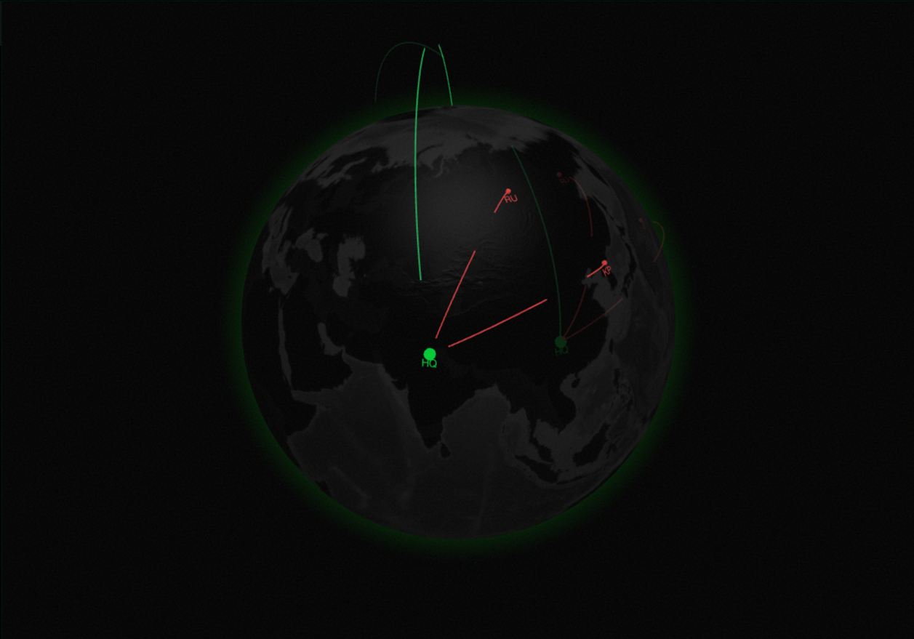
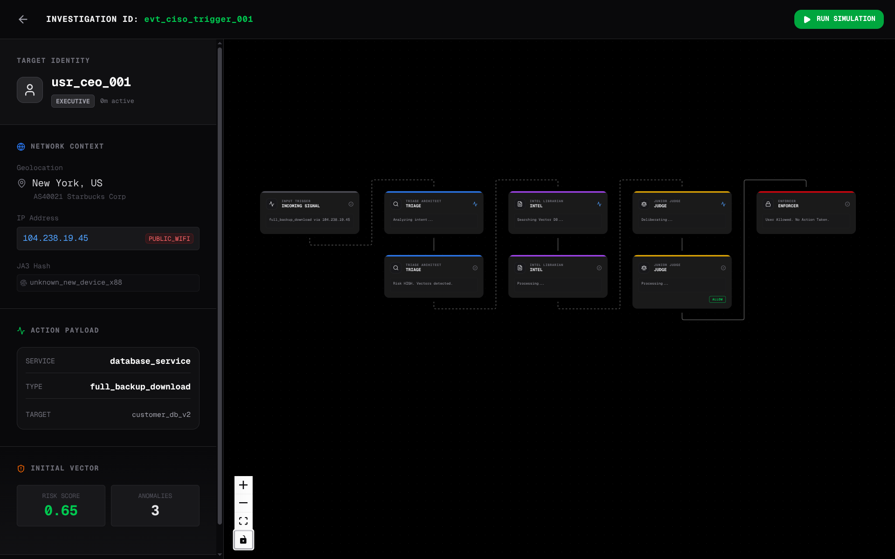

# Sentinel Auditor Dashboard

**Real-time Security Operations Center for Threat Investigation**

[](https://nextjs.org)
[](https://react.dev)
[](https://typescriptlang.org)
[](https://supabase.com)
[](https://docker.com)

## Overview

The Sentinel Dashboard provides visibility into the investigation pipeline. It serves as a Security Operations Center (SOC) interface for monitoring global threats and inspecting agent decision steps.

## System Architecture

```mermaid
flowchart LR
    %% --- Classes (High Contrast Neon) ---
    classDef lane fill:#09090b,stroke:#27272a,stroke-width:2px,color:#fff
    classDef externalLane fill:#000,stroke:#3f3f46,stroke-width:2px,stroke-dasharray: 5 5,color:#a1a1aa

    classDef logic fill:#1e1b4b,stroke:#818cf8,stroke-width:2px,color:#c7d2fe
    classDef router fill:#3f0c28,stroke:#f472b6,stroke-width:2px,color:#fbcfe8
    classDef component fill:#022c22,stroke:#2dd4bf,stroke-width:2px,color:#ccfbf1
    classDef db fill:#000,stroke:#84cc16,stroke-width:2px,color:#ecfccb,shape:cylinder
    classDef stream fill:#1a2e05,stroke:#bef264,stroke-width:2px,color:#ecfccb,shape:circle

    %% --- LANE 1: SECURITY & SESSION ---
    subgraph Sec ["1. SECURITY & SESSION"]
        direction TB
        MW[Middleware]:::logic
        JWT[JWT Verify]:::logic
        SESS[Session]:::logic
        
        MW --> JWT --> SESS
    end

    %% --- LANE 2: ROUTING ---
    subgraph Pages ["2. PAGE ROUTING"]
        direction TB
        HOME[Main View]:::router
        INV[Investigate]:::router
    end

    %% --- LANE 3: UI COMPONENTS ---
    subgraph UI ["3. UI COMPOSITION"]
        direction TB
        GLOBE[HoloGlobe]:::component
        FEED[LogFeed]:::component
        FLOW[XYFlow Graph]:::component
        META[Metadata Panel]:::component
    end

    %% --- LANE 4: EXTERNAL DATA (Bottom) ---
    subgraph Data ["EXTERNAL SERVICES"]
        direction LR
        SB[(Supabase)]:::db
        RT((Realtime)):::stream
        SB ==> RT
    end

    %% --- MAIN FLOW CONNECTIONS ---
    SESS ==> HOME
    SESS ==> INV

    HOME -.-> GLOBE
    HOME -.-> FEED
    
    INV -.-> FLOW
    INV -.-> META

    %% --- DATA INJECTION CONNECTIONS ---
    RT -.->|Live Updates| FEED
    RT -.->|Live Updates| FLOW

    %% --- STYLING THE LANES ---
    style Sec fill:#0f172a,stroke:#1e293b,stroke-width:0px
    style Pages fill:#000000,stroke:#333,stroke-width:0px
    style UI fill:#0f172a,stroke:#1e293b,stroke-width:0px
    style Data fill:#000,stroke:#333,stroke-width:1px,stroke-dasharray: 5 5
```



## User Interface & Workflow

### 1. The HoloGlobe (Threat Map)



| | |
|---|---|
| **Tech** | `react-globe.gl` |
| **Function** | Visualizes the origin of authentication attempts using IP geolocation. |
| **UX** | Threats appear in Red, legitimate traffic in Green. Arcs show attack velocity. |

### 2. The Investigation Graph (Agent Replay)



| | |
|---|---|
| **Tech** | XYFlow (React Flow) + Dagre Layout |
| **Function** | A temporal graph showing agent execution steps. |
| **UX** | Analysts can navigate the timeline to see when the Intel Agent retrieved a policy and why the Judge Agent issued a block. |

### 3. Log Feed

| | |
|---|---|
| **Tech** | Supabase Realtime |
| **Function** | Real-time feed of incoming audit logs. |
| **UX** | New logs appear in the stack; clicking a log routes to the specific Investigation ID. |

## Core Features

### Authentication
- **Middleware Protection**: Routes protected by Next.js Middleware using `jose` for stateless JWT verification.
- **Session Management**: HTTP-only cookie reassembly handles session tokens exceeding standard cookie limits.
- **Login UI**: CSS animations for fingerprint scanning effect.

### Event Handling
- **Live Subscription**: Connects to Postgres INSERT events via Supabase Realtime (WebSockets).
- **Deduplication**: React state uses `Map()` for O(1) lookups to prevent UI jitter with high-velocity streams.
- **Risk Scoring**: Color interpolation maps risk scores (0-100) to visual indicators (Teal → Orange → Crimson).

### Replay System
- **Trace Parsing**: The dashboard parses the linear JSON trace from the API and builds a DAG (Directed Acyclic Graph) for visualization.
- **Auto-Layout**: Uses Dagre algorithms to organize agent steps hierarchically.
- **Node Inspection**: Clicking a node opens the Inspector Panel, showing the context, retrieved policy text, and LLM confidence scores.

## Project Structure

```
dashboard/
├── app/
│   ├── page.tsx              # Main dashboard (globe + feed)
│   ├── login/page.tsx        # Login UI
│   ├── investigate/[id]/     # Investigation replay page
│   └── layout.tsx            # Root layout with fonts
├── components/
│   ├── dashboard/
│   │   ├── HoloGlobe.tsx     # 3D threat visualization
│   │   ├── LogFeed.tsx       # Real-time event list
│   │   └── investigate/
│   │       ├── AgentCard.tsx      # XYFlow custom node
│   │       ├── InspectorPanel.tsx # Node detail drawer
│   │       └── MetadataPanel.tsx  # Event context sidebar
│   └── auth/
│       └── AccessDenied.tsx  # Unauthorized state
├── lib/
│   └── supabaseClient.ts     # Supabase browser client
├── middleware.ts             # JWT + session verification
├── Dockerfile               # Multi-stage Node 22 build
└── package.json
```

## Quick Start

```bash
# Clone repository
git clone https://github.com/your-repo/sentinel-auditor.git
cd sentinel-auditor/auditor

# Configure environment
cp dashboard/.env.local.example dashboard/.env.local
# Edit dashboard/.env.local with your keys:
#   NEXT_PUBLIC_SUPABASE_URL
#   NEXT_PUBLIC_SUPABASE_ANON_KEY
#   SUPABASE_JWT_SECRET

# Launch full stack
docker-compose up --build
```

Dashboard runs at `http://localhost:3001`.

## Environment Variables

| Variable | Description |
|----------|-------------|
| `NEXT_PUBLIC_SUPABASE_URL` | Supabase project URL |
| `NEXT_PUBLIC_SUPABASE_ANON_KEY` | Supabase anonymous key for client |
| `SUPABASE_JWT_SECRET` | JWT secret for token verification |

## Container Architecture

The dashboard uses a **Multi-Stage Docker Build**:

1. **Builder Stage**: Uses `node:22-alpine` to install dependencies and compile the Next.js app.
2. **Standalone Output**: Leverages `output: 'standalone'` in `next.config.js` to isolate necessary production `node_modules`.
3. **Runner Stage**: A minimal Alpine image that runs the server, reducing image size.

## Technology Stack

- **Framework**: Next.js 16 (App Router)
- **Runtime**: React 19, TypeScript 5
- **Styling**: Tailwind CSS 4, Framer Motion
- **Auth**: Supabase SSR, jose (Stateless JWT)
- **Visualization**: react-globe.gl, XYFlow (React Flow)
- **State**: React Hooks + Supabase Realtime
- **Container**: Docker Multi-stage, pnpm
